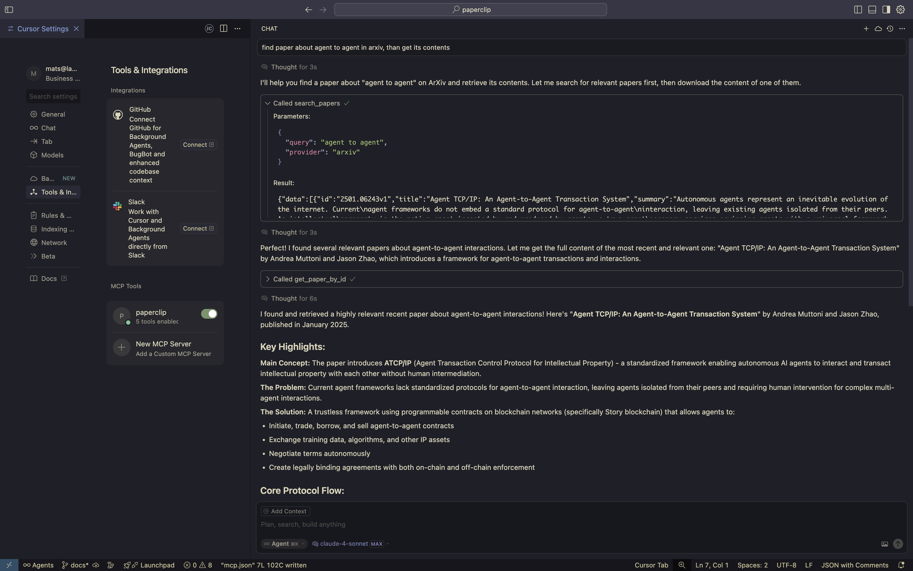

<div align="center">
  
  
  # Paperclip MCP Server
</div>

> 📎 Paperclip is a Model Context Protocol (MCP) server that enables searching and retrieving research papers from Arxiv, the Open Science Framework (OSF) API, and OpenAlex.

[](https://github.com/matsjfunke/paperclip/actions/workflows/tests.yml)
[](https://github.com/matsjfunke/paperclip/actions/workflows/ping-server.yml)

## Quick Start

Setup the paperclip MCP server in your host via the server url `https://paperclip.matsjfunke.com/mcp` no authentication is needed.

Example JSON for cursor:

```json
{
  "mcpServers": {
    "paperclip": {
      "url": "https://paperclip.matsjfunke.com/mcp"
    }
  }
}
```

## Table of Contents

- [Quick Start](#quick-start)
- [Usage Examples](#usage-examples)
- [Supported Paper providers](#supported-paper-providers)
- [Preprint Providers to be added](#preprint-providers-to-be-added)
- [Contributing](#contributing)

## Usage Examples

Here are examples of Paperclip integrated with popular MCP clients:

**Cursor IDE:**



**Langdock:**


## Supported Paper providers

- [AfricArXiv](https://africarxiv.org)
- [AgriXiv](https://agrirxiv.org)
- [ArabXiv](https://arabixiv.org)
- [arXiv](https://arxiv.org)
- [BioHackrXiv](http://guide.biohackrxiv.org/about.html)
- [BodoArXiv](https://bodoarxiv.wordpress.com)
- [COP Preprints](https://www.collegeofphlebology.com)
- [EarthArXiv](https://eartharxiv.org)
- [EcoEvoRxiv](https://www.ecoevorxiv.com)
- [ECSarxiv](https://ecsarxiv.org)
- [EdArXiv](https://edarxiv.org)
- [EngrXiv](https://engrxiv.org)
- [FocusArchive](https://osf.io/preprints/focusarchive)
- [Frenxiv](https://frenxiv.org)
- [INArxiv](https://rinarxiv.lipi.go.id)
- [IndiaRxiv](https://osf.io/preprints/indiarxiv)
- [Law Archive](https://library.law.yale.edu/research/law-archive)
- [LawArXiv](https://osf.io/preprints/lawarxiv)
- [LISSA](https://osf.io/preprints/lissa)
- [LiveData](https://osf.io/preprints/livedata)
- [MarXiv](https://osf.io/preprints/marxiv)
- [MediArXiv](https://mediarxiv.com)
- [MetaArXiv](https://osf.io/preprints/metaarxiv)
- [MindRxiv](https://osf.io/preprints/mindrxiv)
- [NewAddictionSx](https://osf.io/preprints/newaddictionsx)
- [NutriXiv](https://niblunc.org)
- [OpenAlex](https://openalex.org)
- [OSF Preprints](https://osf.io/preprints/osf)
- [PaleoRxiv](https://osf.io/preprints/paleorxiv)
- [PsyArXiv](https://psyarxiv.com)
- [SocArXiv](https://socopen.org/welcome)
- [SportRxiv](http://sportrxiv.org)
- [Thesis Commons](https://osf.io/preprints/thesiscommons)

## Preprint Providers to be added

[List of preprint repositorys](https://en.wikipedia.org/wiki/List_of_preprint_repositories)

- bioRxiv & medRxiv both share the underlying api structure (https://api.biorxiv.org/pubs/[server]/[interval]/[cursor] where [server] can be "biorxiv" or "medrxiv")
- ChemRxiv
- [hal open science](https://hal.science/?lang=en)
- [research square](https://www.researchsquare.com/)
- [osf preprints](https://osf.io/preprints)
- [preprints.org](https://preprints.org)
- [science open](https://www.scienceopen.com/)
- [SSRN](https://www.ssrn.com/index.cfm/en/the-lancet/)
- [synthical](https://synthical.com/feed/new)

## Contributing

Interested in contributing to Paperclip? Check out our [Contributing Guide](CONTRIBUTING.md) for development setup instructions, testing procedures, and more!
